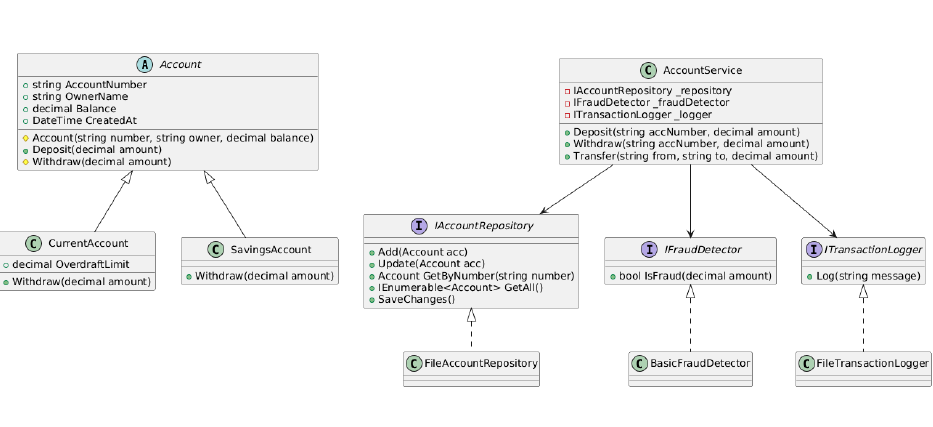

# CitéBanque – Console Banking Application

## Overview
Console-based banking application developed in C# using Object-Oriented Programming (OOP) principles.  
Simulates a banking system that allows managing multiple types of accounts, performing deposits, withdrawals, transfers, and saving/loading data.

---

## Features

**Account Management**
- Create Current or Savings accounts
- List all accounts
- Search by account number, owner, type, or balance

**Banking Operations**
- Deposit, withdraw, and transfer money
- Handle insufficient funds and invalid accounts

**Data Persistence**
- Save/load accounts and transaction data to/from files

**Extensibility**
- Designed following SOLID principles
- Easy to add new account types or logging mechanisms

---

## Architecture

**Domain Layer:** Core entities (`Account`, `CurrentAccount`, `SavingsAccount`) and exceptions  
**Application Layer:** `AccountService` handles all operations  
**Infrastructure Layer:** File repositories, fraud detection, and transaction logging  
**UI Layer:** Console interface (`ConsoleMenu`)  

---

## Class Diagram

*The diagram shows relationships between accounts, services, and repositories.*

---

## Project Structure

/Application -> Services and business logic
/Domain -> Entities, interfaces, exceptions
/Infrastructure -> File repositories, logging, fraud detection
/UI/Console -> Console interface & main program
/Utils -> Helper classes
/bin & /obj -> Build artifacts

---

## Usage
1. Clone the repository:

  git clone https://github.com/TaniaBdj/school-banking-app.git
  cd school-banking-app

2. Open the project in Visual Studio (or any .NET 8 compatible IDE)

3. Build and run the project

4.Use the console menu to:

  Create accounts

  View accounts

  Search accounts

  Deposit, withdraw, transfer money

  Save/load account data
  
  Exit safely
